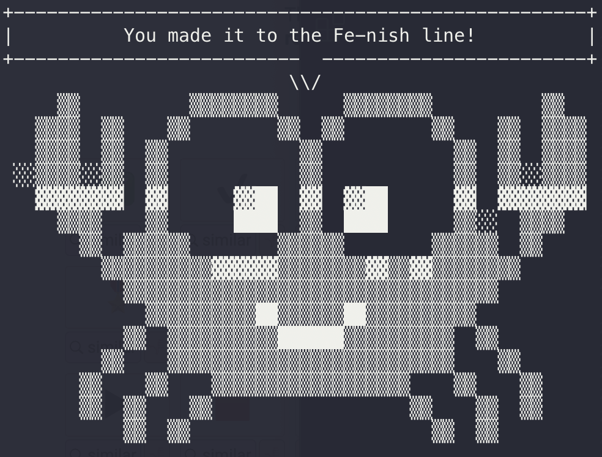

# Learning Rust 🦀

## Overview
This repository documents my progress and notes while learning Rust, a systems programming language emphasizing safety and performance.

## Learning Resources
I am using two primary resources for learning Rust:

1. [**The Rust Programming Language**](https://rust-book.cs.brown.edu/) - Completed ✅ 
2. [**rustlings**](https://github.com/rust-lang/rustlings) - Completed ✅

## Repository Structure
- `/the-rust-programming-language` - Notes for each chapter of the book.
- `/rustlings` - Solutions for rustlings exercises.

## Usage
This repository serves as a personal log of my learning process in Rust. 
It can also be used by those seeking examples of Rust code or an understanding of the concepts covered in the learning materials mentioned.
Contributions for corrections or suggestions are welcome.

